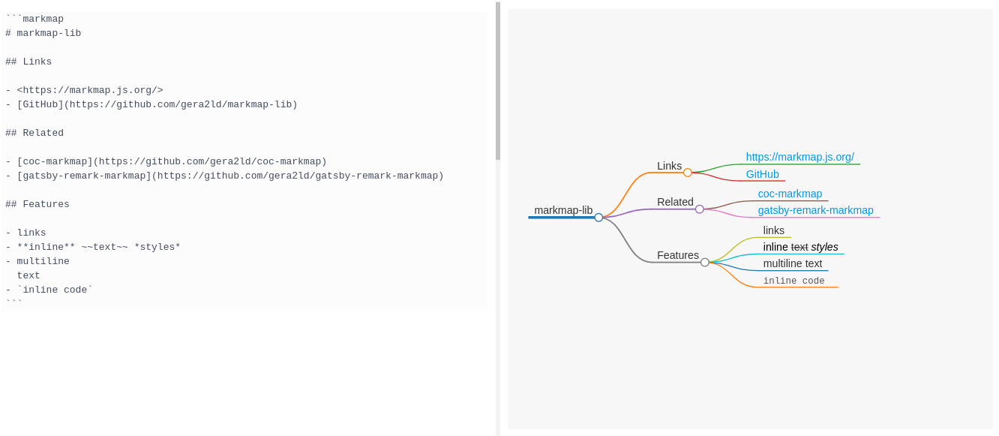

# Markmap-lib renderer for Inkdrop
 

A plugin for [Inkdrop](https://www.inkdrop.info/) which adds a renderer for [markmap-lib](https://markmap.js.org/)


## Example
````
```markmap
# markmap-lib

## Links

- <https://markmap.js.org/>
- [GitHub](https://github.com/gera2ld/markmap-lib)

## Related

- [coc-markmap](https://github.com/gera2ld/coc-markmap)
- [gatsby-remark-markmap](https://github.com/gera2ld/gatsby-remark-markmap)

## Features

- links
- **inline** ~~text~~ *styles*
- multiline
  text
```
````

This will be rendered as


## Install

```sh
ipm install markmap
```

## Changelog
- 1.0.0
  - integrate markmap-lib 0.9.1 for Inkdrop 5.x
